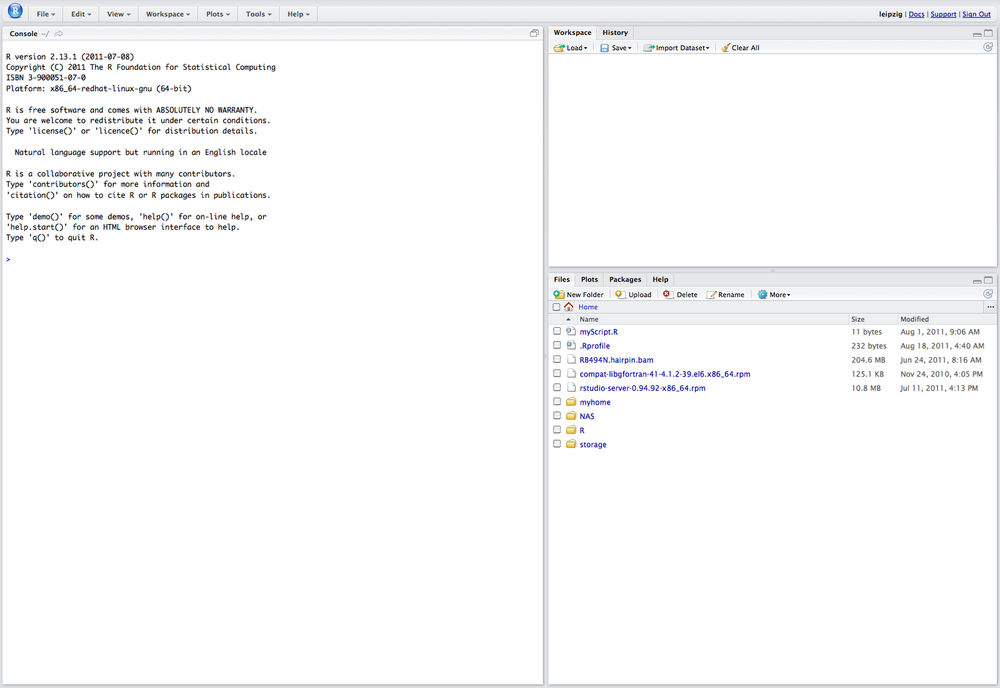

One month ago, I was asked to build a R package for my boss with her source codes. I tried several different ways to handle this problem, truely I suffered a lot especially with the updating of new versions until I find the best way. Now I quite enjoy building my R packages, it's cool and I think it worths taking a note and spreading. Most of the notes here was learnt and copied from serveral big guys' posts. like the book [R packages](http://r-pkgs.had.co.nz/) from [Hadley Wickham](http://had.co.nz/), [Writing an R package from scratch](http://hilaryparker.com/2014/04/29/writing-an-r-package-from-scratch/) from [Hilary Parker](http://biostat.jhsph.edu/~hiparker/) and [开发R程序包之忍者篇](http://cos.name/2011/05/write-r-packages-like-a-ninja/) from [Xie Yihui](http://yihui.name), also the official document [Writing R extensions](http://cran.r-project.org/doc/manuals/R-exts.html). Thanks all these guys' efforts to make our life easy and cool.

### 1. why a R package and what?


### 2. Requirements!
To be cool, the most important requirement for building a R package is a [Rstudio](http://www.rstudio.com/products/RStudio/).
If you are not or not willing to use **Rstudio**, then you can skip this blog and you must prefer reading the "corny" [Writing R extensions](http://cran.r-project.org/doc/manuals/R-exts.html) (well I don't mean that!). Anyway, it's not cool to build a package without Rstudio, and I promise you will love it.

> Anything that can be automated, should be automated. Do as little as possible by hand.                            --- [Hadley Wickham](http://had.co.nz/)


Open the [Rstudio webpage]((http://www.rstudio.com/products/RStudio/)), download the suitable version for your computer and install. On Windows, you will get the interface as below when you launch Rstudio:


```{r, echo = FALSE, eval=FALSE}
bookdown::embed_png("pictures/Rstudio_screenshot.png", dpi = 220)
```

Several important places on this interface is labbled in red circle. Take a note, and you will need them later.

### 3. Let's get started:
On the left panel of the Rstudio interface is your R console, where executes your R commands. One thing you may concern if where the working directory is. Using the commnad below to check your working directory and change to where you want to build you package.
```{r, eval=FALSE}
getwd()
setwd("xxx/yyy/yourWorkingDirectory")
```

Well, we are ready to build our package, have you got the name for your package, how about **coolRer**. Let's start, type the commands below in your console following an Enter.
```{r, eval=FALSE}
devtools::creat("coolRer")
```

Check the **Files** button on the Rstudio and see **what happened**? Actually the skeleton for your package is created, cool or not? You can also locate to your selected working directory to check the files created for your R package:

            ***** a screenshot here *****

*  An RStudio project file, **pkgname.Rproj**.
*  An **R/** directory.
*  A basic **DESCRIPTION** file.
*  A basic **NAMESPACE** file.

Wow, this is almost all the things for a package, maybe better here to see an example R package [rmini](https://github.com/yihui/rmini).

Congradualtions, you are one step(small but giant) closer to get your own R apckage. Warm up and let's get ready for an [exploration](http://science.nationalgeographic.com/science/space/space-exploration/moon-exploration-article/).

#### 3.1 R pakcage structure introduction

OK, seriously, we need a [tomato timer](http://tomato-timer.com/) now, there is something we need well understanding, then to be cool. For a simple package, the components listed above is enough for building a package, while, it's necessary for us to take a glance of the big structure of a poweful R package (the mooncake).

```{r, eval=FALSE,highlight=FALSE}
pkgName (the name of your package)
 | 
 |---- DESCRIPTION 
 |---- NAMESPACE
 |---- R (R source codes)
         |---- function1.R 
         |---- function2.R 
         |---- ... 
 |---- man (help documentss)
         |---- function1.Rd 
         |---- function2.Rd 
         |---- ... 
 |---- vignettes (vignette source files)
 |---- data (rda data)
 |---- demo (demo R codes)
 |---- src (code of other language)
 |---- inst (will remain in the root dir of the pkg)
         |---- doc (vignettes result files)
```

Let's take a look at what each part of the package does...

##### R/

Clever, this is where you put your R scripts. Note that you can’t use subdirectories inside in `R/`. While you’re free to arrange functions into files as you wish, the two extremes are bad: don’t put all functions into one file and don’t put each function into its own separate file.

##### DESCRIPTION

Every package must have a `DESCRIPTION`. In fact, it’s the identification card of a package. The description in `DESCRIPTION` will vary a bit depending on your settings, but should look something like this:

```{r, eval=FALSE}
Package: myPackageName
Title: (What the package does, one line)
Version: 0.99.1  (version ID)
Authors@R: "First Last <first.last@example.com> [aut, cre]" 
Description: (What the package does, one paragraph)
Depends: R (>= 3.1.0)
License: What license is it under? (GPL-3)
LazyData: true
Imports: (packages need be imported) 
Suggests: (suggested packages)
```

The `Package`, `Version`, `License`, `Description`, `Title`, `Author`, and `Maintainer` are mandatory fields for a `DESCRIPTION` file, all other fields are optional. Fields `Author` and `Maintainer` can be auto-generated from `Authors@R`[about Authors@R](http://r.789695.n4.nabble.com/Author-R-td4359909.html), and may be omitted if the latter is provided.

*  `Package` field gives the name of the package. This should contain only (ASCII) letters, numbers and dot, have at least two characters and start with a letter and not end in a dot. 

*  `Version` field gives the version of the package. This is a sequence of at least two (and usually three) non-negative integers separated by single ‘.’ or ‘-’ characters. The canonical form is as shown in the example, and a version such as ‘0.01’ or ‘0.01.0’ will be handled as if it were ‘0.1-0’. It is not a decimal number, so for example 0.9 < 0.75 since 9 < 75. 

*  `License` field give the liscence of your package.

*  `Description` field should give a comprehensive description of what the package does. One can use several (complete) sentences, but only one paragraph. 

*  `Title` field should give a short description of the package. It should be capitalized, not use any markup, not have any continuation lines, and not end in a period. 

*  `Author` field describes who wrote the package. It is a plain text field intended for human readers, but not for automatic processing.

*  `Maintainer` field should give a single name followed a valid (RFC 2822) email address in angle brackets. It should not end in a period or comma. 

*  `Imports` and `Suggests` differ in their strength of dependency. `Imports`: packages listed here must be present for your package to work, Any time your package is installed, those packages will be checked and be installed on your computer if it's not installed; `Suggests`: your package can take advantage of packages listed here, while these packages are not automatically installed along with your package. 

##### man/ and NAMESPACE

`man/` contains the function documentation (`.Rd` files). It works like a dictionary, which can be accessed by `?` or `help()` to let the user check the details of your function. Let's see one `.Rd` example file below:
 
```{r, eval=FALSE}
\name{myFunction}
\alias{myFunction}
\title{Add together two numbers}
\usage{
myFunction(x, y)
}
\arguments{
  \item{x}{A number}

  \item{y}{A number}
}
\value{
The sum of \code{x} and \code{y}
}
\description{
Add together two numbers
}
\examples{
myFunction(1, 1)
myFunction(10, 1)
}
```

OK, this may make you feel intimidating, what the hell is this? Actually these files use a custom syntax, loosely based on LaTeX, and are rendered to HTML for viewing. 

Forget the above, I’m here to tell you the coolest way. Instead of writing these files by hand, we’re going to use `roxygen2` which turns specially formatted comments into `.Rd files`. The package `roxygen2` that makes everything amazing and simple. The way it works is that you add special comments to the beginning of each function, that will later be compiled into the correct format for package documentation (`.rd` files). 

**roxygen comments** start with `#'` to distinguish them from regular comments. Here’s roxygen documentation example for a simple function:

```{r, eval=FALSE}
#' title(one line)
#'
#' description (one paragraph)
#'
#' details here (any length you want)
#'
#' @param a
#' @param b
#' @return 
#' @author abc <\url{http://abc.com}>
#' @examples
myFunction <- function(a, b){
    return(a + b)
}
```

This seems much more simple but still confusing, right? Well, just a little pain to real this [vignette](http://cran.r-project.org/web/packages/roxygen2/vignettes/rd.html), you need to figure out the meaning of roxygen commnets. But I promise you will find it is worth learning after handling roxygen commnets.

Are you ready to continue? Or wandering if these roxygen commnets can be automatically generated? Currently and unfortunately, this cannot be on Rstudio (I am also waiting) , while there is one tool can do what you want, the [Emacs](http://vgoulet.act.ulaval.ca/en/emacs/) with [ESS](http://ess.r-project.org/)（Emacs Speaks Statistics）plugin. On Emacs, locate your cursor to the name of your function in your R code, and use the shortcut `C-c C-o`, you will find the roxygen commnets template are automatically generated, [cool](http://cos.name/2011/05/write-r-packages-like-a-ninja/)!

As well as generating `.Rd` files, `roxygen2` can also manage your `NAMESPACE` and the Collate field in `DESCRIPTION`. To do this, only two simple steps:

1. Add roxygen comments to your `.R` files. (as the example above)
2. Run `devtools::document()` on the R console (or press `Cmd + Shift + D` in RStudio) to convert roxygen comments to `.Rd` files.

##### 


