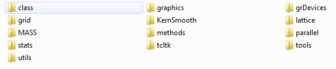

After installation there will creat two librarys for yor R packages, one is the **system library**, and the other is your **user library**.

```{r, eval=FALSE}
> .libPaths()
[1] "C:/Users/hchen/R/win-library/3.1"  
[2] "C:/Program Files/R/R-3.1.1/library"
# user library
> .libPaths()[1]
[1] "C:/Users/hchen/R/win-library/3.1"
# system library
> .libPaths()[2]
[1] "C:/Program Files/R/R-3.1.1/library"
```

In the **system library**, it contains the **13** base packages(as below), and *17* (increasing) suggested packages (if you accept the recommended installation). 

 
 
For example, in **R 3.1.3**, the 30 basic packages in your system library is listed below:

```{r, eval=FALSE}
> dir(.libPaths()[2])
 [1] "base"         "boot"         "class"        "cluster"     
 [5] "codetools"    "compiler"     "datasets"     "foreign"     
 [9] "graphics"     "grDevices"    "grid"         "KernSmooth"  
[13] "lattice"      "MASS"         "Matrix"       "methods"     
[17] "mgcv"         "nlme"         "nnet"         "parallel"    
[21] "rpart"        "spatial"      "splines"      "stats"       
[25] "stats4"       "survival"     "tcltk"        "tools"       
[29] "translations" "utils"    
```

